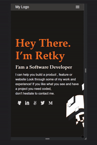

# Mv-HideAndSeek

> This copy of a project, is hidding some bougs to resolve
>

## Live Preview
*Click the Image below*

## Built With

- HTML
- CSS

---

- *Webhint*
- *Stylelint*
- *Lighthouse*

### Prerequisites
If you haven't yet, you should first [set up Git.](https://docs.github.com/en/get-started/quickstart/set-up-git) Don't forget to [set up authentication to GitHub.com from Git](https://docs.github.com/en/get-started/quickstart/set-up-git#next-steps-authenticating-with-github-from-git) as well.

### Usage
- Clone the repository
  - Above the list of files, click **↓Code**
  - Clone with HTTPS
  - Open Terminal
  - Change the current working directory to the location where you want the cloned directory
  - Type `git clone`, and then paste the URL you copied earlier
  - Press Enter. Your local clone will be created
- Create a new issue & comment the bugs

## Author

👤 **J. Luis Arredondo**
- GitHub: [@Retky](https://github.com/Retky "J. Luis Arredondo GitHub")
- Twitter: [@RetkyFox](https://twitter.com/retkyFox "J. Luis Arredondo Twitter")
- LinkedIn: [Retky](https://www.linkedin.com/in/Retky "J. Luis Arredondo LinkedIn")

## 🤝 Contributing

Contributions, issues, and feature requests are welcome!

Feel free to get in touch with any issues or suggestions.

- 🐛 **Bug reports & issues:** Use [GitHub Issues](https://github.com/Retky/Retky-Portfolio/issues)
- 💡 **Suggestions:** Use [Github Discussions](https://github.com/Retky/Retky-Portfolio/discussions)
- 🙋‍♀️ **General questions:** Use [Github Discussions](https://github.com/Retky/Retky-Portfolio/discussions)

## Show your support

Give a ⭐️ if you like this project!

## Acknowledgments

- Microverse
- [Microverse Figma](https://www.figma.com/file/l7SqJ3ZfkAKih9sFxvWSR4/Microverse-Student-Project-1?node-id=1%3A1471)

## 📝 License

This project is [MIT](./MIT.md) licensed.
